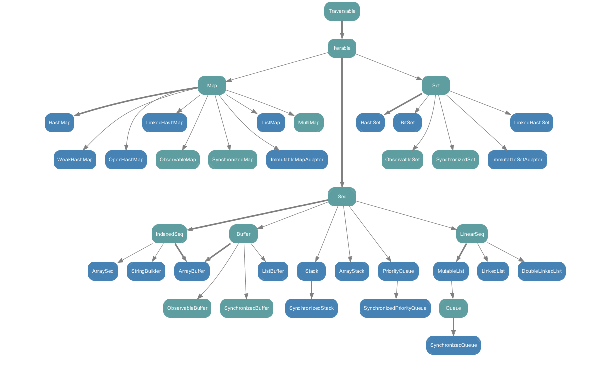

[TOC]

# 实战指南

## 集合



### List

在`Java`中使用`util.List`作为List类型，在`Scala`中`List`是`immutable`类型，因而不能用来作为可变集合，在`Scala`中使用`Buffer/ListBuffer`

### Map

`Scala`中的`Map`存在`mutable`和`immutable`两种类型，根据场景和性能出发，选择最合适的

### Set

`Scala`与`Java`相差不大，也存在`mutable`和`immutable`两种类型

### 与Java的相互操作

#### Scala<=>Java

方式一：引入`scala.collection.JavaConversions._`里的隐式转换方法，会自行转换

方式二：引入 `collection.JavaConverters._`，进而显式调用 asJava() 或 asScala() 方法完成转型

##### 转型字典表

```
* scala.collection.Iterable <=> java.lang.Iterable
* scala.collection.Iterable <=> java.util.Collection
* scala.collection.Iterator <=> java.util.{ Iterator, Enumeration }
* scala.collection.mutable.Buffer <=> java.util.List
* scala.collection.mutable.Set <=> java.util.Set
* scala.collection.mutable.Map <=> java.util.{ Map, Dictionary }
* scala.collection.concurrent.Map <=> java.util.concurrent.ConcurrentMap

* scala.collection.Seq => java.util.List
* scala.collection.mutable.Seq => java.util.List
* scala.collection.Set => java.util.Set
* scala.collection.Map => java.util.Map
* java.util.Properties => scala.collection.mutable.Map[String, String]
```

